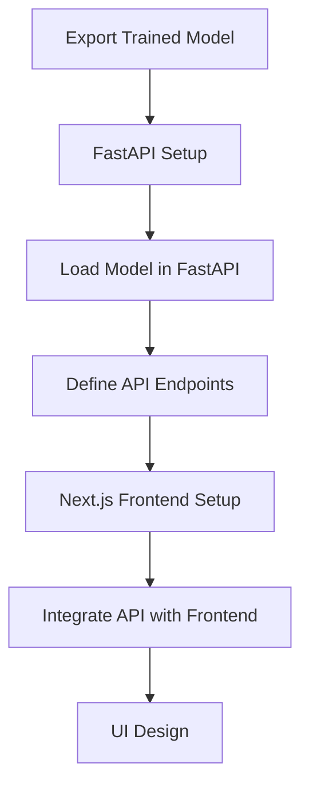
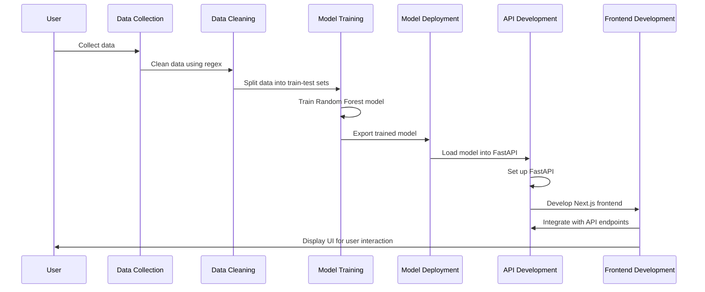
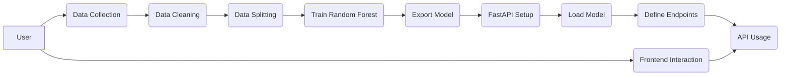
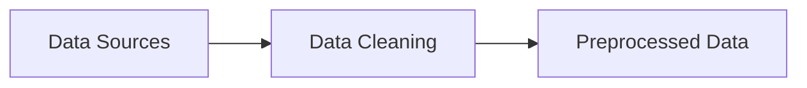
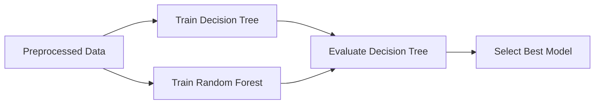
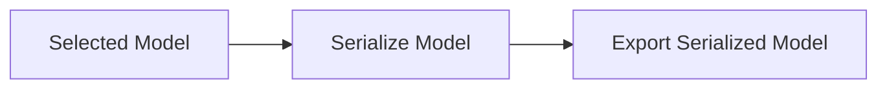
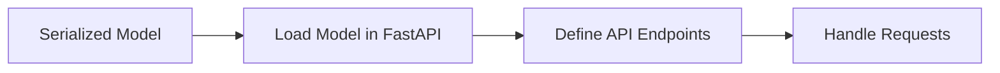
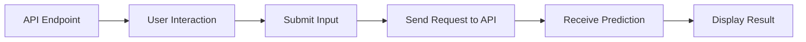

# Activity Diagram

## Sequence Diagram

## Use Case Diagram

## data cleaning module

## data train module

## data select module

## API Development Module (FastAPI)

## Frontend Development Module (Next.js)

